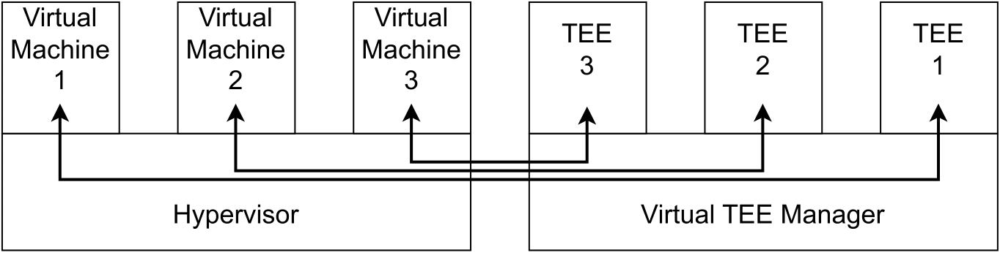
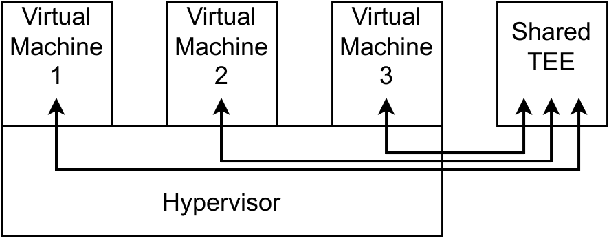
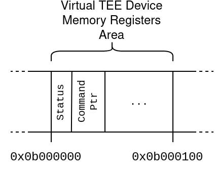

# Sicurezza Hardware in Ambienti Virtualizzati Tramite un Passthrough TEE tra QEMU e Linux

#
#

## Marco Cutecchia
## Relatore: Danilo Bruschi

---

# Trusted Execution Environment (TEE)

- Ambienti **isolati** all'interno di un dispositivo dove eseguire codice, con garanzie di sicurezza extra
- Garantiscono integrità e autenticità del codice, prevedendo anche meccanismi di verifica da remoto (Remote Attestation)
- Garantiscono la riservatezza dei dati, non solo quando sono salvati su disco ma anche quando sono in memoria durante l'esecuzione
    - Estremamente difficile estrarre dati da un TEE, a meno che il software al suo interno non li rilasci volontariamente
- Richiedono supporti hardware dedicati, diversi tra le varie piattaforme
    - ARM TrustZone, Intel SGX, AMD SEV, SoC dedicati

---

# Perchè usare un TEE?

- Mobile: proteggere dati come impronte digitali o chiavi crittografiche, implementare sistemi di pagamento elettronico o di protezione dei contenuti in streaming (DRM)
    * Il TEE, essendo isolato, rimane al sicuro anche se un malware riesce a prendere il controllo del dispositivo
- IoT: costruire sensori sicuri, che non possano essere facilmente compromessi anche se l'attaccante ha accesso fisico al dispositivo
    * Servono attrezzature molto costose per estrarre dati da un TEE in esecuzione
- Cloud: permettere lo sviluppo di servizi web alla quale gli utenti  possono mandare dati, avendo la garanzia che questi non possano essere letti da nessuno, neanche il gestore del servizio
    * Realizzare il **Confidential Computing**

---

# Lo stato attuale del Confidential Computing

- Alcuni provider offrono servizi di Confidential Computing, ma solo per alcuni tipi di macchine, e spesso con lock-in
- Gli sforzi al momento sono per permettere ai clienti di eseguire il proprio codice in un TEE di loro completa responsabilità

#

---

# Proposta alternativa

- Non è necessario spostare tutta l'applicazione dentro il TEE, solo alcuni piccoli componenti di esse. Questi componenti possono essere utili a più applicazioni

- Il provider potrebbe offrire un TEE con dei servizi utili pre-installati

- Questa idea può coesistere con le proposte già esistenti

- Interfaccia esterna GlobalPlatform, uno standard popolare in ambito mobile e IoT

---

# Il progetto

- È necessario implementare un canale di comunicazione tra le macchine virtuali e il TEE, passando attraverso l'hypervisor
- Lo scopo della tesi è stato implementare questo canale
    - Linux nelle macchine virtuali
    - Linux+QEMU come hypervisor
    - OP-TEE come Trusted Execution Environment, un TEE open-source per ARM TrustZone

---

# Il device virtuale e il driver

- Permette a una macchina virtuale di comunicare con il TEE esterno
- Interfaccia basata su MMIO e un semplice protocollo di comunicazione a messaggi  
- Driver integrato nel sottosistema TEE di Linux, il guest può accedere al TEE come se fosse un device normale
- Facilmente portabile su altre macchine o architetture diverse

---

# Sequenza di invio di un messaggio

1. Il driver riceve le richieste dalle applicazioni, le traduce in messaggi corrispondenti e segnala al device virtuale la posizione del messaggio in memoria
 
2. QEMU riceve le richieste del driver, le fa passare attraverso un layer di traduzione, e le inoltra al TEE

3. Il TEE risponde all'hypervisor, che fa passare la risposta ancora attraverso il layer di traduzione, e la scrive nella memoria del guest

4. Il driver legge la risposta dal device virtuale e la restituisce all'applicazione

---

# Layer di traduzione

- Ogni messaggio che TEE e macchine virtuali scambiano possono contenere valori che hanno un significato diverso per le due parti
    * Esempio: Indirizzi di memoria validi in una macchina virtuale, non lo sono nell'hypervisor
- Non è possibile inoltrare i messaggi all'altra parte senza modifiche
- Questo layer ispeziona i messaggi inoltrati e traduce puntatori, identificatori di sessioni, ecc. in modo che siano validi per entrambe le parti

---

# Verificare la correttezza dell'implementazione

- `xtest` è una suite di oltre 40000 test case utilizzati per verificare la correttezza di OP-TEE
- Abbiamo anche effettuato dei primitivi test delle prestazioni, misurando il tempo impiegato per eseguire l'intera suite di test
    * **Overhead di circa l'8%** rispetto a un sistema con accesso diretto al TEE
    * Abbiamo identificato alcune aree di miglioramento che possono ridurlo a meno del 2%
---

# Conclusioni

- Riteniamo che il nostro prototipo dimostri la fattibilità e sensatezza di questo modello operativo
- È un punto di partenza promettente, ma rimangono ancora delle sfide da affrontare:
    * Migrazione dei dati sensibili tra TEE
    * Migliorare le prestazioni
    * Implementare su un hypervisor di tipo 1
